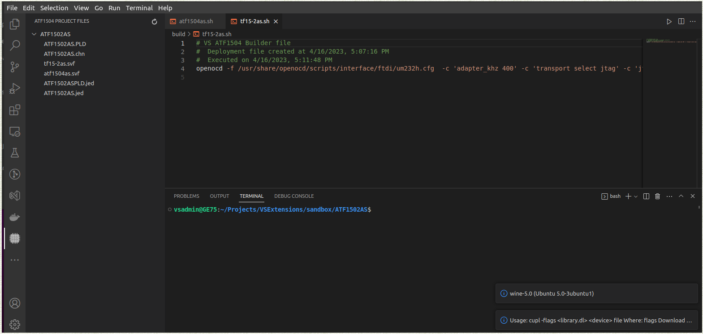
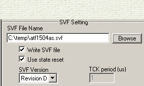

# ATF15xx-Cupl README
## Features

Extension to work with `Cupl` (.PLD_ files)

**Read more about [Cupl syntax](src/assets/docs/CUPL.md)**

- Allows to create a project
- Edit ``PLD`` file
- Compile ``PLD`` to ``jed`` format
- Call ATMISP to convert ``jed`` to ``svf`` format
- Program ``svf`` file to an ISP homebrew ATF1500 family chip programmer

<picture>  
  
</picture>

> ATF15xx Project veiwer with functionality to automate build, convert, and deploy tasks.

---

## Requirements
### Wine
```sudo apt update```

```sudo apt install wine64```

### Updated winetricks
```sudo winetricks --self-update```


### Wine must have MFC42.DLL installed
```./winetricks mfc40```

```./winetricks mfc42```

### Download and copy to wine windows folder
>[Dwsbc32.ocx](src/assets/bin/Dwsbc32.ocx) to ~/.wine/drive_c/windows/system32

>[ftd2xx.dll](src/assets/bin/ftd2xx.dll) to ~/.wine/drive_c/windows/syswow64

### Prochip 5.0.1
Need to have Atmel ProChip (5.0.1) installed [Download ProChip 5.0.1](https://www.microchip.com/prochiplicensing/#/)
### ATMISP
  Need to have Atmel ATMISP (v7.3) [Download ATMISP](http://ww1.microchip.com/downloads/en/DeviceDoc/ATMISP7.zip)
  Need to have FTD2xx.dll file in ATMISP folder


---
## Extension Settings

Include if your extension adds any VS Code settings through the `contributes.configuration` extension point.

For example:

This extension contributes the following settings:

* `ATF15xx.WinePath`: Set wine binary path (e.g. /usr/bin/wine).
* `ATF15xx.OpenOCDPath`: Set OpenOCD binary path (e.g. /usr/bin/openocd).
* `ATF15xx.WinCPath`: Set Windows C:\ path (e.g. /home/user1/.wine/drive_c).
*  `ATF15xx.CuplBinPath`: Cupl executable path relative to WinePath 
  (e.g. Wincupl/Shared/ for c:\\Wincupl\\Shared\\cupl.exe)
* `ATF15xx.AtmIspBinPath`: ATMISP executable path (e.g. ATMEL_PLS_Tools/ATMISP/ATMISP.exe)
* `ATF15xx.WinTempPath"`: Temp path on C:\ drive (e.g. temp)

---
## Known Issues

HAS NOT BEEN TESTED ON WINDOWS

---
## Release Notes

Initial version. Supports full basic process from creating a project to deploying SVF file.
ATMISP is a manual process. User must select "export svf"
<picture>  
  
</picture>

> Support for ATF1504AS chip only!
### 0.0.2

Initial release of ATF15xx-Cupl


---

# For developers
## Following extension guidelines

Ensure that you've read through the extensions guidelines and follow the best practices for creating your extension.

* [Extension Guidelines](https://code.visualstudio.com/api/references/extension-guidelines)


## For more information

* [Visual Studio Code's Markdown Support](http://code.visualstudio.com/docs/languages/markdown)
* [Markdown Syntax Reference](https://help.github.com/articles/markdown-basics/)

