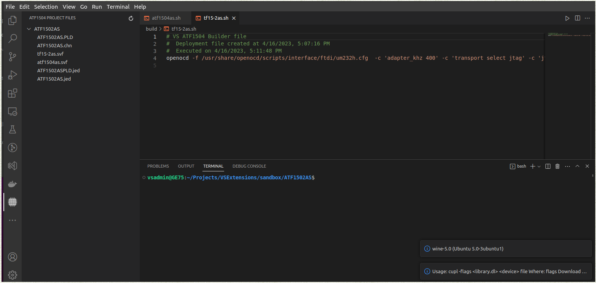
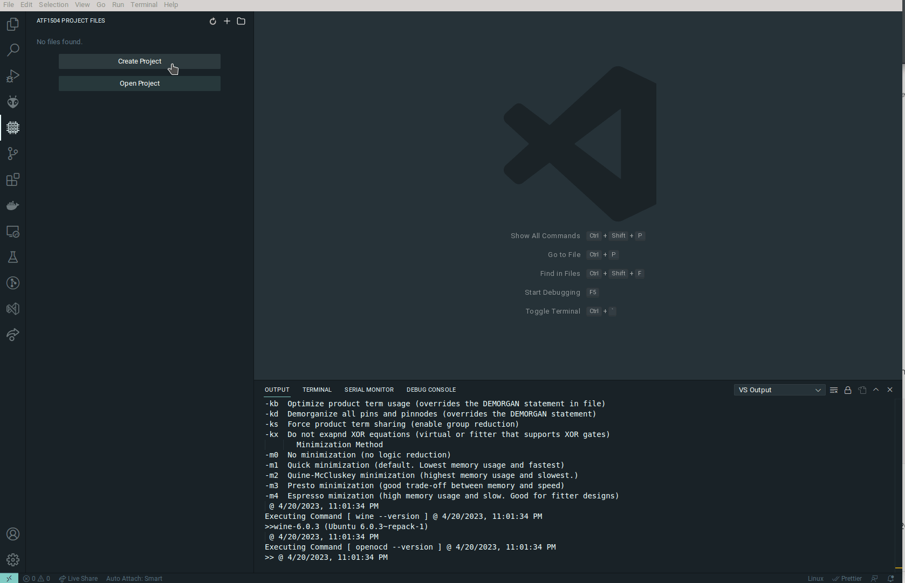
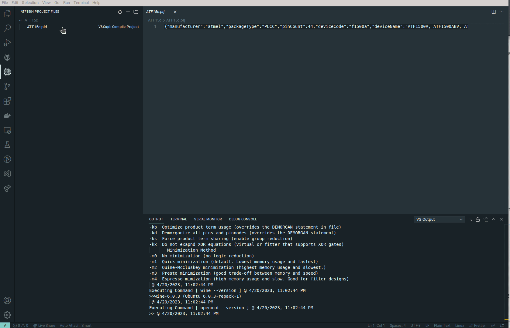
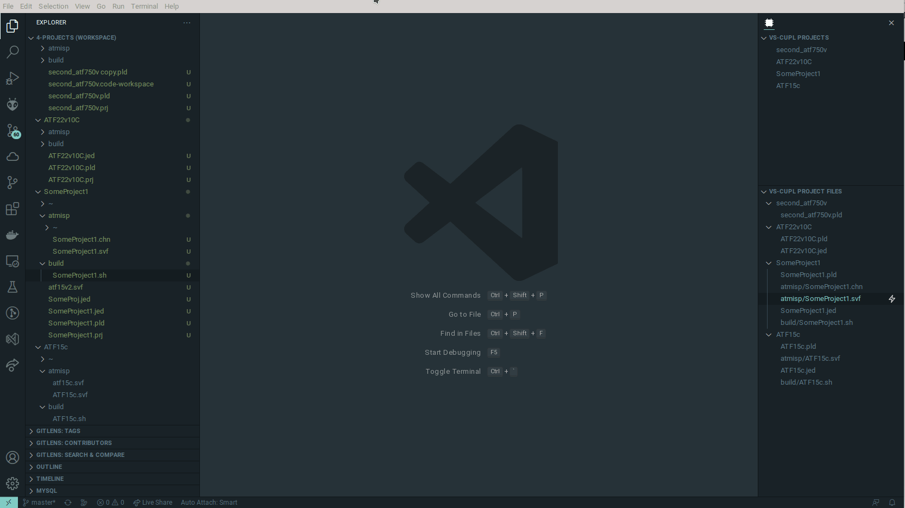
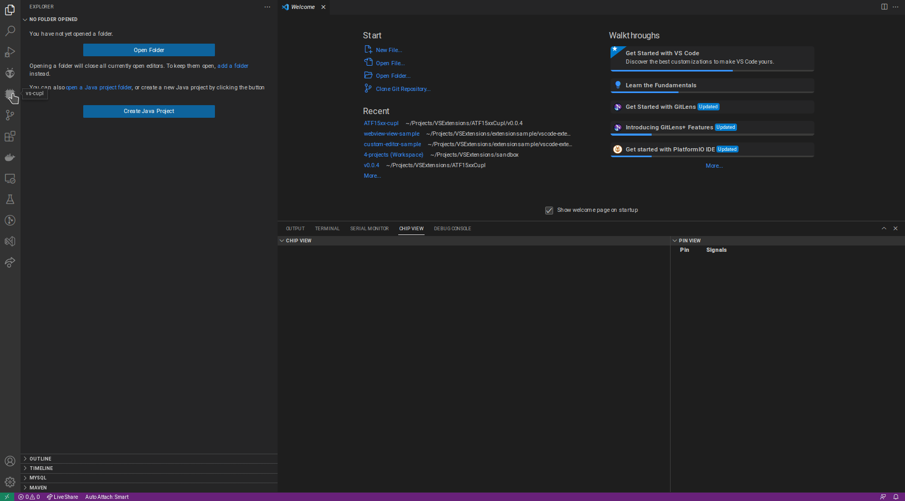
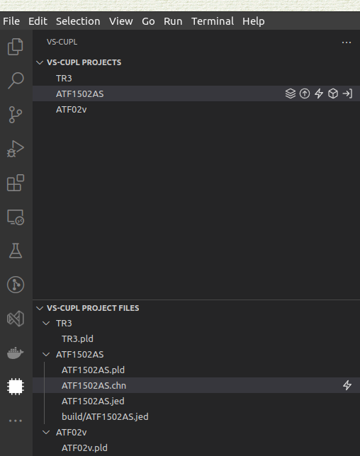
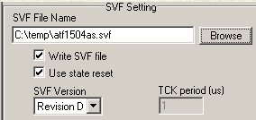

# vs-cupl README
## Features

-
> VS Project veiwer with functionality to automate build, convert, and deploy tasks.
---

Extension to work with `Cupl` (.PLD files)

Supports deployment paths to TL886+ for DIP and other 24 and 28 pin CPLDs and homebrew programmer for QFP chips.

### **SO FAR, ONLY TESTED ON ATF1504AS, ATF1504ASLV and g20v10**

- Allows to create a project


- Edit ``PLD`` file
- Compile ``PLD`` to ``jed`` format


- Call ATMISP to convert ``jed`` to ``svf`` format
- Program ``svf`` file to an ISP homebrew ATF1500 family chip programmer


---
## Workspace folders

Use VS Code workspace feature to keep your projects organized.
Structure should be

 - ```/workspace``` folder - when creating a project, use this folder as your root folder.

- ```/workspace/PROJECT1``` - creating a project named PROJECT1 would create the folder

- ```/workspace/PROJECT1\PROJECT1.pld``` - creating a project named PROJECT1 would create the default cupl file

> For multiple projects, the same root folder wiil have several project folders

- ```/workspace``` 

- ```/workspace/PROJECT1```

- ```/workspace/PROJECT1\PROJECT1.pld``` 

- ```/workspace/PROJECT2```

- ```/workspace/PROJECT2\PROJECT2.pld```


Save your Code Workspace file to the workspace folder.
This folder can represent one product that has seceral chips or projects.
- ```/workspace/my-widget-project.code-workspace``` 

---

## Requirements
### **Wine**
```sudo apt update```

```sudo apt install wine64```

#### Updated winetricks
```sudo winetricks --self-update```


#### Wine must have MFC42.DLL installed
```./winetricks mfc40```

```./winetricks mfc42```

### Download and copy to wine windows folder
>[Dwsbc32.ocx](assets/bin/Dwsbc32.ocx) to ~/.wine/drive_c/windows/system32

>[ftd2xx.dll](assets/bin/ftd2xx.dll) to ~/.wine/drive_c/windows/syswow64

### **Prochip 5.0.1**
Need to have Atmel ProChip (5.0.1) installed [Download ProChip 5.0.1](https://www.microchip.com/prochiplicensing/#/)
### **ATMISP**
  Need to have Atmel ATMISP (v7.3) [Download ATMISP](http://ww1.microchip.com/downloads/en/DeviceDoc/ATMISP7.zip)
  Need to have FTD2xx.dll file in ATMISP folder

### **Minipro**
  Used for programming jed files using TL866II programmer
```shell
sudo apt-get install build-essential pkg-config git libusb-1.0-0-dev fakeroot debhelper dpkg-dev

git clone https://gitlab.com/DavidGriffith/minipro.git

cd minipro

fakeroot dpkg-buildpackage -b -us -uc

sudo dpkg -i ../minipro_0.4-1_amd64.deb
```
---
## Extension Settings

This extension contributes the following settings:

*Can be configured in File > Preferences > Settings `` |`` Extensions > VS Cupl*

* `VS.WinePath`: Set wine binary path (default: /usr/bin/wine).
* `VS.OpenOCDPath`: Set OpenOCD binary path (default: /usr/bin/openocd).
* `VS.MiniproPath`: Set minipro binary path (default: /usr/bin/minipro).
* `VS.WinCPath`: Set Windows C:\ path (default: /home/user1/.wine/drive_c).
*  `VS.CuplBinPath`: Cupl executable path relative to WinePath 
  (default: Wincupl/Shared/ for c:\\Wincupl\\Shared\\cupl.exe)
* `VS.AtmIspBinPath`: ATMISP executable path (default: ATMEL_PLS_Tools/ATMISP/ATMISP.exe)
* `VS.WinTempPath`: Temp path on C:\ drive (default: temp)

---

**Read more about [Cupl](https://ece-classes.usc.edu/ee459/library/documents/CUPL_Reference.pdf)**

---
## Known Issues

### For Windows
 > There are hoops that you will need to jump, and some are on fire

 Additional considerations for cupl
 > Register directory with fitters (in administrative command prompt)

 ```
  @"%SystemRoot%\System32\WindowsPowerShell\v1.0\powershell.exe" -NoProfile -ExecutionPolicy Bypass -Command "[Environment]::SetEnvironmentVariable('path',\"c:\Wincupl\WinCupl\Fitters;$([Environment]::GetEnvironmentVariable('path','Machine'))\",'Machine');"
 ```
 To install OpenOCD:

 [OpenOCD](https://github.com/xpack-dev-tools/openocd-xpack/releases)
 - Download and extract to path (C:\Programs\openocd)
 - Execute in Administrative command window
 ```
 @"%SystemRoot%\System32\WindowsPowerShell\v1.0\powershell.exe" -NoProfile -ExecutionPolicy Bypass -Command "[Environment]::SetEnvironmentVariable('path',\"C:\Programs\openocd\bin;$([Environment]::GetEnvironmentVariable('path','Machine'))\",'Machine');"
 ```

[minipro](https://gitlab.com/DavidGriffith/minipro.git)

Install MSYS2 from here: [MSYS2](https://www.msys2.org/)
### **In msys2 terminal**
```
pacman -S mingw-w64-ucrt-x86_64-gcc
pacman -S make
pacman -S pkg-config
pacman -S git
pacman -S gcc


git clone https://gitlab.com/DavidGriffith/minipro.git
cd minipro

#fix errors preventing compilation
echo -e '#include "minipro.h" \n#include "version.h"' > version.c
echo -e '#define VERSION "0.6"\n#ifndef GIT_DATE\n\t#define GIT_DATE "01/01/2001"\n#endif\n#ifndef GIT_BRANCH\n\t#define GIT_BRANCH "main"\n#endif\n#ifndef  GIT_HASH\n\t#define GIT_HASH "blahblahblah"\n#endif' > version.h

make

cd c:\\msys64\\home\\%USERNAME%\\minipro
SETX PATH=%PATH%;%cd%;
```
### **In command prompt or powershell (NOT MSYS2)**

cd [path of where minipro build saved minipro.exe]

e.g.

```
cd c:\\msys64\\home\\%USERNAME%\\minipro
SETX PATH=%PATH%;%cd%;C:\\msys64\\usr\\bin
```
or
 ```
 @"%SystemRoot%\System32\WindowsPowerShell\v1.0\powershell.exe" -NoProfile -ExecutionPolicy Bypass -Command "[Environment]::SetEnvironmentVariable('path',\""C:\msys64\usr\bin;C:\msys64\home\\minipro;$([Environment]::GetEnvironmentVariable('path','Machine'))\",'Machine');"
 ```
### **VS Code must be restarted after updating these paths**


### **Homebrew programmer for ATF15xx CPLDs**

https://github.com/hackup/ATF2FT232HQ

---
## Release Notes

### v0.2.0
> Implemented Chip View

  Shows pins and type of chip for project

  Double click will add pin to PLD or go to line in PLD if already added

  Refactor other functionality, test all functionality on linux. Limited testing on Windows
  

### 0.1.3
> Intellisense and other syntax related implementations

> Explorer  File menu improvements

> Refactor project structure in memory out of extension project file provider

> Bug fixes

### 0.1.0
> Windows support (beta)
> Shortcuts to create/import/open project from explorer menu
### 0.0.7
> Renamed to vs-cupl
> UI Improvements: New menu options and view to maange projects.
### 0.0.5
> Adding support for minipro and GAL22V10/ATF22V10 chips

> Refactor project file naming and parsing

> Refactor Tree View (soltion folder => projects folder => project files)


### 0.0.2

Initial release of vs-cupl
> Support for ATF1504AS chip only!


Initial version. Supports full basic process from creating a project to deploying SVF file.
ATMISP is a manual process. User must select "Write SVF file"



---

# For developers

## Requirements
You may need to install resolve-cwd npm package
```npm install resolve-cwd```

## To start developing

```
git clone https://github.com/levvayner/ATF15xx-cupl.git
cd ATF15xx-cupl
npm install
code .
```
This will open up the project in visual studio. You can press F5 to start debugging.


## Following extension guidelines

Ensure that you've read through the extensions guidelines and follow the best practices for creating your extension.

* [Extension Guidelines](https://code.visualstudio.com/api/references/extension-guidelines)


## For more information

* [Visual Studio Code's Markdown Support](http://code.visualstudio.com/docs/languages/markdown)
* [Markdown Syntax Reference](https://help.github.com/articles/markdown-basics/)

